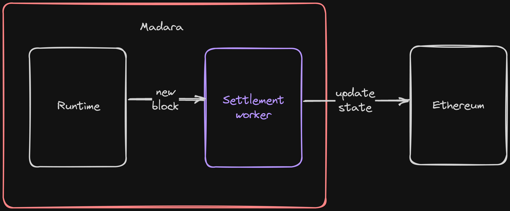
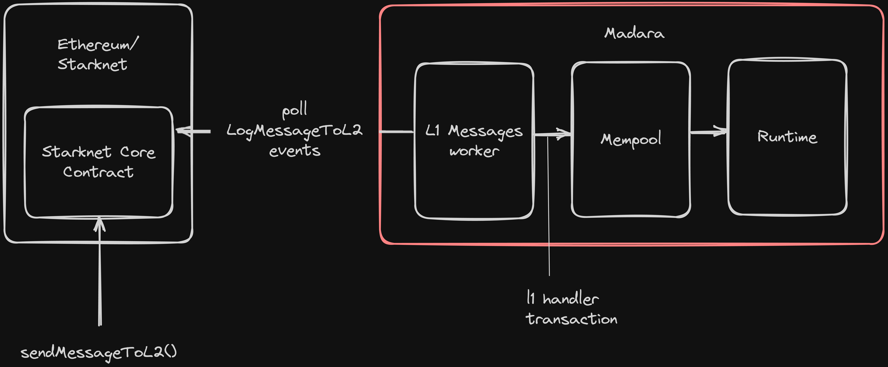
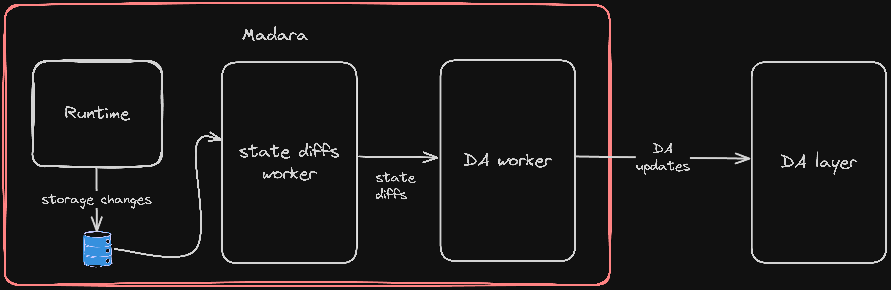
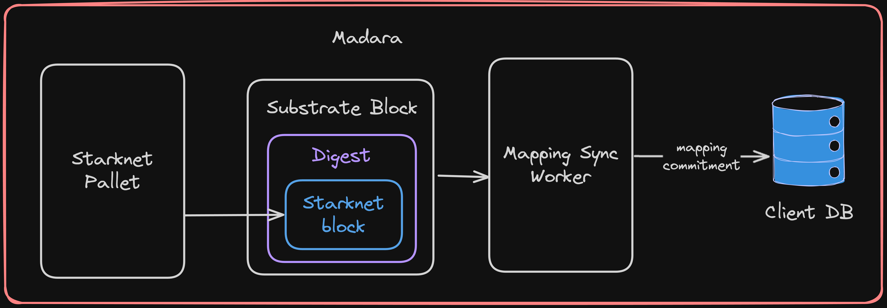

# Madara Architecture

## Building on Substrate

Many of the existing blockchain stacks are just open-source versions of the L2 chain. While this ensures you've something that has been tested in production, it
takes a big hit on modularity. This is because most L2 chains were designed to get faster to the market in a safe way. Naturally, this led to cutting edges at places
where you could be experimental and enable more modularity.

We didn't want this to be the case with Madara. We wanted to build a stack for app chain developers which was not only secure but also flexible. As a result, for the Madara stack,
we decided to take advantage of the Substrate framework. Substrate has been in production for 5+ years and it secures more than a billion dollars in production. At the same time, Substrate
was always designed to be flexible so that you could build any chain using it. You can see the 150+ chains that are built on top of it [here](https://parachains.info/).

## Forking Substrate

While Substrate is definitely powerful, there are some parts that can modified to make the stack work better for L2s/L3s. Particularly, we have [forked Substrate](https://github.com/massalabs/polkadot-sdk/tree/release-polkadot-v1.3.0-std)
to achieve the following

1. Making the runtime `std` compatible: We currently rely on multiple Starknet libraries ([blockifier](https://github.com/starkware-libs/blockifier),
   [cairo-vm](https://github.com/lambdaclass/cairo-vm), [cairo](https://github.com/starkware-libs/cairo), [starknet-api](https://github.com/starkware-libs/starknet-api)) in Madara. These libraries
   don't support `no-std` compatibility as of today which is needed in Substrate runtimes for [forkless upgrades](https://docs.substrate.io/maintain/runtime-upgrades/). Moreover, the Substrate runtime
   is also compiled to `WASM` (which is why it needs to be `no-std` compatible) which also slows down the performance by ~2x. As a result, after analyzing the tradeoff, we decided to fork away Substrate
   to enable `std` in the runtime.
2. Using the Bonzai trie: The bonzai tree isn't compatible with the existing traits exposed by Substrate. By forking it, we are also able to use the Bonzai tree for Madara which will be much more efficient.

## Transaction Lifecycle

The above architecture diagram shows all the major components of Madara. Below, we describe the functionalities of each component and also walk through the lifecycle of a transaction.

##### JSON RPC Client

When a transaction is first created, it reaches the JSON RPC client inside the [mc-rpc](https://github.com/keep-starknet-strange/madara/blob/main/crates/client/rpc/src/lib.rs) (mc = madara-client) crate.
All the RPC methods over here are defined inside [mc-rpc-core](https://github.com/keep-starknet-strange/madara/blob/main/crates/client/rpc-core/src/lib.rs). The `mc-rpc` crate contains the logic on how
to read user inputs, convert them into required formats, perform necessary validation logic and return a response to the user. The validation logic itself is inside the runtime (pallet-starknet) but is called
from here.

##### Pallet Starknet

[Pallets](https://docs.substrate.io/reference/frame-pallets/) are a Substrate term that refers to modules which can be used to add business logic to your runtime. User transactions usually trigger some function
inside a pallet. The [Starknet pallet](https://github.com/keep-starknet-strange/madara/blob/main/crates/pallets/starknet/src/lib.rs) is the core component of Madara where the majority of the execution and storage happens.
As shown in the diagram above, the validation and execution logic are defined inside the Starknet pallet.

##### Blockifier

The [blockifier](https://github.com/starkware-libs/blockifier) is the component used by the Starknet sequencer in production for executing transactions and creating blocks. For Madara, the block-building logic
is native to the framework. However, we still import the blockifier to execute Cairo contracts.

##### Cairo VM

The [Cairo VM](https://github.com/lambdaclass/cairo-vm), as the name suggests, is the virtual machine of the Cairo language. It can take any Cairo program and the inputs and return the expected output.

##### Validation logic

Once the RPC client receives a user transaction, it's forwarded to the validation logic inside the runtime. The validation logic defined [here](https://github.com/keep-starknet-strange/madara/blob/7900c0b884ee3fb978711ff65b19e98f0c143c03/crates/pallets/starknet/src/lib.rs#L732),
checks if the transaction is correct and can be added to the mempool. This involves nonce and signature checks. Since Madara supports account abstraction, accounts in Madara can have custom validation logic -
different curves, OTPs, session keys, and anything that can be written in code. However, this also means that to validate transactions, we need to trigger the VM and call the validation logic of the contract. This is done by calling
the blockifier.

While the method is called `validate_unsigned`, the transaction actually contains the signature. As we support account abstraction, we don't use the default validation logic of Substrate based on public and private keys. Instead, we keep Starknet
transaction as [unsigned extrinsics](https://docs.substrate.io/learn/transaction-types/#unsigned-transactions) and call the `validate` logic of the account contract inside `validate_unsigned`.

If the transaction passes validation, it's sent to the mempool, and the transaction hash is sent back to the user. If the validation fails, an error is propagated back to the user.

##### Mempool

We use the default mempool of Substrate in Madara as of now. All transactions of an account are ordered based on the nonce as it can be seen [here](https://github.com/keep-starknet-strange/madara/blob/7900c0b884ee3fb978711ff65b19e98f0c143c03/crates/pallets/starknet/src/lib.rs#L755).

##### Execution logic

Starknet has 4 write transactions and the execution logic for all of them is defined in the starket pallet

1. **Invoke transactions**: These are the most common transactions that are used to interact with existing smart contracts or deploy new contracts. [Code](https://github.com/keep-starknet-strange/madara/blob/7900c0b884ee3fb978711ff65b19e98f0c143c03/crates/pallets/starknet/src/lib.rs#L487).
2. **Deploy account transactions**: These are special transactions that are used to deploy accounts on the chain. As mentioned, Madara supports account abstraction which means your account needs to be deployed before it can be used. However, most wallets
   abstract this part from the user and you don't even realize when your wallets get deployed! [Code](https://github.com/keep-starknet-strange/madara/blob/7900c0b884ee3fb978711ff65b19e98f0c143c03/crates/pallets/starknet/src/lib.rs#L598).
3. **Declare transactions**: These are used to declare new contracts which can later be deployed using `INVOKE` (for normal smart contracts) and `DEPLOY_ACCOUNT` (for account contracts) transactions. [Code](https://github.com/keep-starknet-strange/madara/blob/7900c0b884ee3fb978711ff65b19e98f0c143c03/crates/pallets/starknet/src/lib.rs#L539).
4. **L1 Handler transactions**: These transactions are unique in the sense that they aren't initiated by accounts on your Madara chain. Instead, as the name suggests, these transactions are initiated by some actions on the base layer (Ethereum for L2s and Starknet for L3s)
   and are used to trigger some code on your chain. For example, sending money on the L1 bridge and minting new tokens on the L2. We've off-chain workers, as explained below, which handle the execution of these messages. [Code](https://github.com/keep-starknet-strange/madara/blob/7900c0b884ee3fb978711ff65b19e98f0c143c03/crates/pallets/starknet/src/lib.rs#L654).

To read more about the first three transaction types, refer to the Starknet docs [here](https://docs.starknet.io/documentation/architecture_and_concepts/Network_Architecture/transactions/). To read more about L1-L2 messaging, read the docs [here](https://docs.starknet.io/documentation/architecture_and_concepts/Network_Architecture/messaging-mechanism/).

In general, the pallet

1. Recevies a transaction from the mempool
2. Does the nonce and signature validation once again
3. Does a minimum balance check on the account (so that it can pay for transaction fees)
4. Executes the transactions and makes the required storage changes.
   1. For transaction execution, we pass the details to the blockifier which calls the VM internally
   2. For storage changes, we call the [blockifier state adapter](https://github.com/keep-starknet-strange/madara/blob/main/crates/pallets/starknet/src/blockifier_state_adapter.rs). This is a `struct` which implements the `StateChanges` trait from the blockifier. The blockifier takes this as input when executing
      transactions and calls it when it needs to read and write to the storage. Our implementation of the state adapter interacts with the pallet storage from Substrate to serve the required data to the blockifier.
5. Charges the fee for transaction execution

## Offchain workers

Offchain workers is a [Substrate term](https://docs.substrate.io/learn/offchain-operations/#off-chain-workers) and can be described as tasks that run asynchronously along with the runtime. They can interact with the runtime to
learn about blocks, transactions, and other details but as they don't live inside the runtime itself, they don't slow down block production. Madara runs multiple off-chain workers as described below

##### Settlement

The [settlement worker](https://github.com/keep-starknet-strange/madara/blob/main/crates/client/settlement/src/lib.rs) is responsible for collecting the new block and transaction data and converting that into `StarknetOsOutput`.
The `StarknetOsOutput` is what is sent to the Starknet core contract on the base layer. In the case of Ethereum, this means calling the [updateState](https://etherscan.io/address/0xc662c410C0ECf747543f5bA90660f6ABeBD9C8c4#writeProxyContract#F16) function
on the core contract.

When you send a message from an L2 to the L1 (or from an L3 to the L2), the settlement worker is also responsible for pushing that message.

##### L1->L2 Messaging

Madara allows [L1-L2 messaging](https://docs.starknet.io/documentation/architecture_and_concepts/Network_Architecture/messaging-mechanism/) just like Starknet. L2->L1 messages are sent using the settlement worker. However, for L1->L2 messages
(or L2->L3 depending on how you're running your app chain), we need a service that constantly listens to new messages on the base layer. This is what the [l1-messages](https://github.com/keep-starknet-strange/madara/blob/main/crates/client/l1-messages/src/worker.rs) worker does.
This worker is configured to listen to `LogMessageToL2` events fired by the Starknet core contract on the base layer. For public Starknet, you can find this contract [here](https://etherscan.io/address/0xc662c410C0ECf747543f5bA90660f6ABeBD9C8c4#code). This worker listens to these events,
transforms the event data, and constructs the [HandleL1MessageTransaction](https://github.com/keep-starknet-strange/madara/blob/7900c0b884ee3fb978711ff65b19e98f0c143c03/crates/primitives/transactions/src/lib.rs#L187) struct. This transaction then enters the mempool and is handled as
explained above.

##### State Diffs

Starknet is one of the few L2s that posts state diffs instead of transaction data for DA. This allows Starknet to be comparatively cheaper and Madara follows the same decision. The [state diffs worker](https://github.com/keep-starknet-strange/madara/blob/7900c0b884ee3fb978711ff65b19e98f0c143c03/crates/client/commitment-state-diff/src/lib.rs#L140)
listens to changes on the pallet storage. New changes are committed every new block and fetched in the state diffs worker. The worker then transforms the storage changes into this [form](https://github.com/keep-starknet-strange/madara/blob/7900c0b884ee3fb978711ff65b19e98f0c143c03/crates/client/commitment-state-diff/src/lib.rs#L140) which
is later used by the DA worker to submit to the respective DA layer.

##### Data availability

Madara tries to be as modular as possible at each layer of the stack. That's why, Madara doesn't force app chains to use a specific DA layer. At the time of writing this, we support [Ethereum](https://github.com/keep-starknet-strange/madara/blob/7900c0b884ee3fb978711ff65b19e98f0c143c03/crates/client/data-availability/src/ethereum/config.rs#L14),
[Avail](https://github.com/keep-starknet-strange/madara/blob/7900c0b884ee3fb978711ff65b19e98f0c143c03/crates/client/data-availability/src/avail/config.rs#L11) and [Celestia](https://github.com/keep-starknet-strange/madara/blob/7900c0b884ee3fb978711ff65b19e98f0c143c03/crates/client/data-availability/src/celestia/config.rs#L9) as DA layers with
[EigenDA](https://github.com/keep-starknet-strange/madara/pull/1377) and [NearDA](https://github.com/keep-starknet-strange/madara/pull/1232) in the works. We also support a generic [DA interface](https://github.com/keep-starknet-strange/madara/blob/7900c0b884ee3fb978711ff65b19e98f0c143c03/crates/client/data-availability/src/lib.rs#L102) which can
be used to add another DA layer.

After the state diffs worker has finished building the state diffs, they are propagated to the DA worker. The DA worker then creates a proof for these state diffs if needed and submits the data to the respective DA layer.

##### Mapping Sync Worker

Substrate has a block structure by default. However, if your chain follows something different (like in the case of Madara), you can use the [wrapper technique](https://corepaper.org/substrate/wrapper/)(first used by frontier for their EVM chain) to wrap your blocks
inside Substrate blocks. As a part of doing this, you need to keep a mapping of Substrate blocks and Madara blocks so that you can serve RPC requests based on Madara block hashes. This is specifically what the [mapping sync worker](https://github.com/keep-starknet-strange/madara/blob/main/crates/client/mapping-sync/src/lib.rs) does.

Substrate blocks have a section called `digests` where you can add pallet logs. So in the starknet pallet, we add the Madara block as a part of the Substrate block digest as you can see [here](https://github.com/keep-starknet-strange/madara/blob/7900c0b884ee3fb978711ff65b19e98f0c143c03/crates/pallets/starknet/src/lib.rs#L983).
This block digest is then consumed by the worker over [here](https://github.com/keep-starknet-strange/madara/blob/7900c0b884ee3fb978711ff65b19e98f0c143c03/crates/client/mapping-sync/src/sync_blocks.rs#L25) and stored in the mapping DB in the form of a
[mapping_commitment](https://github.com/keep-starknet-strange/madara/blob/7900c0b884ee3fb978711ff65b19e98f0c143c03/crates/client/mapping-sync/src/sync_blocks.rs#L43).
