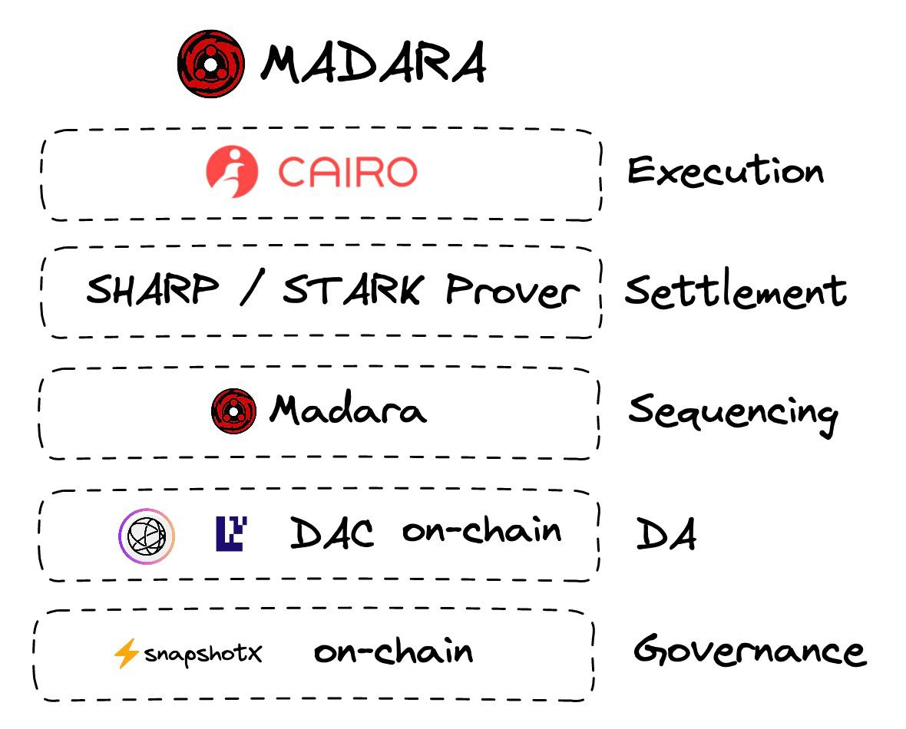

import { Callout } from 'nextra-theme-docs'

# 1) ¿Qué es Madara?

**Madara ha sido construido por el Equipo de Exploración de Starkware, también conocido como *[Keep Starknet Strange](https://github.com/keep-starkne)*, para apoyar 
la [visión de escalado fractal](https://medium.com/starkware/fractal-scaling-from-l2-to-l3-7fe238ecfb4f) que Starkware planteó hace años.**

Hay muchas razones por las que uno querría tener su propio L3 en lugar de construir directamente sobre Starknet:

- Hiper-escalabilidad
- Mejor control
- Privacidad
- Interoperabilidad más barata/simplificada

Madara abre todo un nuevo campo de innovación; los desarrolladores de aplicaciones pueden experimentar con diferentes soluciones de disponibilidad de datos, algoritmos de consenso y esquemas de prueba.

En la sección `Construir en Madara` encontrará información detallada sobre las distintas soluciones que se están explorando y sus ventajas y desventajas.

## 2) H

El componente central de Madara es la paleta `Starknet`. Proporciona una capa de compatibilidad Starknet para Substrate. 
Gracias a ella, el código Cairo existente puede ejecutarse sin problemas.

Esta paleta, además del módulo RPC, permite la emulación de bloques Starknet, valida las transacciones codificadas en 
Starknet y hace posible desplegar una DApp Starknet existente en Madara sin ningún cambio.

## 3) A

Quizás te preguntes cómo podemos asignar bloques de Substrate a bloques de Starknet.

Bueno, utilizamos el método del [bloque envoltorio](https://corepaper.org/substrate/wrapper/) utilizado por primera vez por Parity en frontier,
la capa de compatibilidad EVM para Substrate.

Wrapper block es una estrategia de Substrate que permite procesar bloques que no se diseñaron originalmente con Substrate en mente.

Añade una ligera sobrecarga de rendimiento, pero es insignificante en comparación con otros componentes del tiempo de ejecución.

## La pila Madara

Por ahora, centrémonos en la visión general de alto nivel y raspemos la superficie de cada una de estas capas.

### Ejecución

La capa de ejecución define la forma en que se ejecutan los bloques y se producen las diferencias de estado. Madara facilita el cambio entre dos cajas de ejecución diferentes, 
[blockifier](https://github.com/starkware-libs/blockifier) de Starkware y [starknet_in_rust](https://github.com/lambdaclass/starknet_in_rust) de LambdaClass.

**Cairo VM**

Bajo el capó, siempre se ejecutará el [Cairo VM](https://github.com/lambdaclass/cairo-rs) que está siendo mantenido por Starkware y LambdaClass en Rust. 
Cairo (CPU Algebraic Intermediate Representation) es un lenguaje de programación para escribir programas demostrables, donde una parte puede probar a otra que un cierto cálculo se ejecutó correctamente.

- [Cairo Whitepaper](https://eprint.iacr.org/2021/1063) 🐺
- [Cairo 1 Docs](https://www.cairo-lang.org/docs/v1.0/) 🦀
- [Cairo Book](https://cairo-book.github.io/) 📒

<Callout type="info" emoji="ℹ️">
  ! Se están realizando experimentos para modificar la máquina virtual de El Cairo cambiando, por ejemplo, el tamaño de los campos a Ricitos de Oro, lo que podría suponer un importante aumento del rendimiento.
</Callout>

### Liquidación

Como Validity Rollup, el estado de cualquier cadena de Madara debería poder construirse únicamente mirando su capa de liquidación.  
Madara en sí no hace ninguna suposición con respecto a la capa de liquidación elegida.  
Si tomamos el ejemplo de un L3, entonces enviaría regularmente una prueba a Starknet para un lote de bloques L3.

<Callout type="info" emoji="ℹ️">
  ! Por ejemplo, Starknet liquida actualmente cada ~5 horas, sobre todo por el coste que supone liquidar en Ethereum. Mientras que un L3 podría en la práctica liquidar mucho más a menudo en Starknet por una fracción del coste.
</Callout>

El término de **liquidación** puede ser engañoso, es importante en última instancia hacer la diferencia entre la finalidad **SOFT** y **HARD**.

Una vez que se alcanza la firmeza **HARD**, es decir, que la transacción ha sido probada y verificada en la capa de liquidación, entonces queda grabada en piedra. 
La finalidad **SOFT** es, en última instancia, mejorar la experiencia del usuario. Sin embargo, veremos que descentralizando la capa de secuenciación podemos aspirar a una finalidad **SOFT** bastante fuerte.

### Secuenciación

La secuenciación es realizada por Madara y puede ser ajustada de diferentes maneras para adaptarse a sus propias necesidades.

Por ejemplo, podría ser un simple FCFS, PGA o esquemas más complejos como Narwhall & Bullshark o [HotStuff](https://github.com/keep-starknet-strange/madara/issues/180).

El orden de las transacciones es bastante importante para garantizar una buena protección MEV y asegurar un orden justo de las transacciones. Aunque, en algunos casos como las cadenas específicas de aplicaciones, se pueden implementar mempools encriptados que garanticen un orden justo.

Madara es por defecto un secuenciador **descentralizado**, múltiples nodos pueden unirse a la red y el consenso por defecto es [GRANDPA  &  BABE](https://docs.substrate.io/learn/consensus/), el utilizado por la mayoría de las parachains polkadot. Creemos que aunque los secuenciadores 
centralizados son el estándar de la industria por ahora, descentralizar la capa de secuenciación es de suma importancia para tener sistemas realmente resistentes a la censura.

### Disponibilidad de datos

En la actualidad, Starknet funciona en modo rollup, tal y como se describe [aqui](https://docs.starknet.io/documentation/architecture_and_concepts/Data_Availability/on-chain-data/). La disponibilidad de datos (DA) significa que el árbol de estados completo está siempre disponible, 
lo que proporciona a los usuarios la seguridad de saber que si StarkEx deja de funcionar alguna vez, pueden demostrar la custodia de sus fondos.

En estos momentos se están experimentando diferentes esquemas de DA para Madara:

- Modo Validium: Los datos están disponibles fuera de la cadena. El Comité de Disponibilidad de Datos (DAC) los almacena, proporcionando una solución de confianza.
- Celestia
- Eigen DA
- Modo Rollup

Cada modo DA viene con su propio conjunto de suposiciones y los desarrolladores de aplicaciones son libres de experimentar e ir con lo que se sientan más cómodos.

### Gobernanza

Snapshot X sería la opción principal para el gobierno en Madara, ya que es un sistema de gobierno totalmente en cadena que se basa en pruebas de almacenamiento. 
Verás en los diferentes hacks de Madara, como el de Turbo VM, por qué las pruebas de almacenamiento serán la primera opción de mecanismo de puente dentro del ecosistema de Madara.

También se están explorando otros mecanismos de gobernanza, como la [paleta de gobernanza](https://github.com/keep-starknet-strange/madara/issues/82) de sustratos nativos. 
Teniendo en cuenta lo que hemos visto en el pasado, uno de los valores fundamentales de Madara es la gobernanza en la cadena. Creemos sinceramente que la gobernanza debe ser siempre aplicable en la cadena, como ocurre en los ecosistemas Cosmos y Polkadot.

<Callout type="default" emoji="🧩">
  Una de las mejores características que Madara ofrece gracias a estar construida con Substrate es la actualización sin **tenedores**. Puedes leer más sobre ello [aquí](https://docs.substrate.io/maintain/runtime-upgrades/#:~:text=To%20perform%20a%20forkless%20runtime,part%20of%20the%20consensus%20process).
</Callout>
