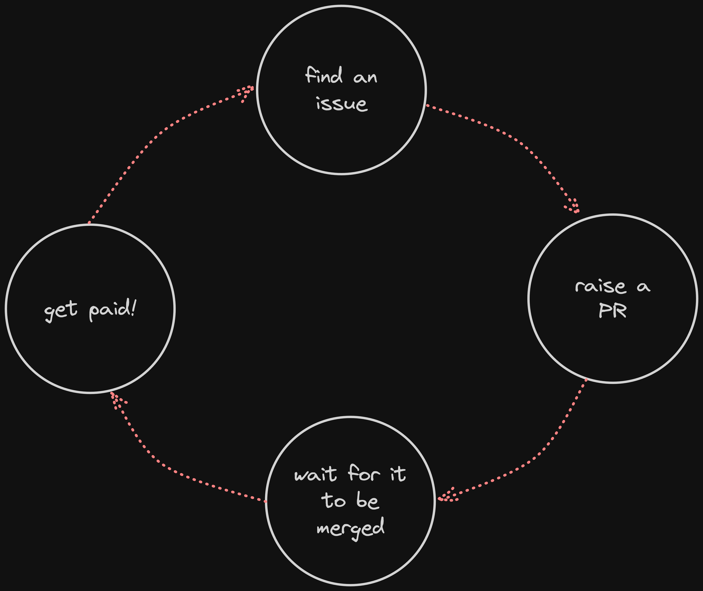

import { Steps } from "nextra-theme-docs";

# Contributing to Madara

One of the major things that sets Madara apart from other stacks is the culture. We've been built since day one as an open-source
stack where anyone can contribute. The Madara developers aren't limited to any one company and at the time of writing this Madara has **90+ contributors**
spread all across the world. Also, being open source doesn't mean you contribute just out of personal interest (though that's very important of course!). Every contribution in
Madara is paid via [OnlyDust](https://app.onlydust.com/p/madara)!

> Note: At the moment, multiple companies including but not limited to Starkware, Pragma, Karnot, and Kasar Labs are involved in maintaining Madara. However, this doesn't limit new
> individuals and companies to join and become core contributors as well. However, with time, we have put a higher bar on code quality to ensure the robustness and maintainability of
> the stack

## Steps to contribute

<Steps>

### Find an issue

First and foremost, if you're new, go through the [contributor starter pack](https://github.com/keep-starknet-strange/madara/blob/main/docs/contributor-starter-pack.md). This precisely details
the prerequisites needed to start contributing to Madara. Once you have done that, it's time to dive in! There are plenty of issues at the Madara Github [here](https://github.com/keep-starknet-strange/madara/issues).
Go through the issues and look for something that you find interesting. You can search for `good-first-issues` to get something easier to start with.

### Comment on the issue

Now that you've found an issue that has grabbed your attention, it's time to dig deeper. If you've any questions, you can comment on the issue itself, and the author or one of the maintainers should respond.
Also, feel free to send your questions on the [Madara telegram](https://t.me/MadaraStarknet) to get faster responses. Once you've made up your mind to contribute to the issue, ask one of the maintainers to assign you
the task. Once assigned, you can start contributing!

### Start coding!

After the issue has been assigned to you, you can start coding! Make sure you ask as many questions as possible on Github or Telegram. It's common to have too many questions in the start but don't worry, we're
here to help. We really want you to be the next core contributor so don't shy away from asking that "one more" question 😉.

### Raise the PR

Awesome! Looks like you've resolved the issue. So raise a PR from your fork and request a review from one of the maintainers. If you're a developer, you are already familiar with this phase. Once your PR has been reviewed
and you've resolved the comments (if any), it should be merged!

### Get paid

Congratulations 🎉. If your PR has been merged, you're eligible for payment via [OnlyDust](https://app.onlydust.com/p/madara). Please link your Github to OnlyDust and you should receive your payment
within a week or two.

</Steps>
