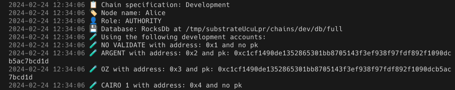

# 用 --dev 标志运行 Madara

`--dev` 标志在 Madara 中运行开发模式，为简化应用链开发流程带来若干优势。部分特性包括在启动链时，提供预先充值资金、预先部署的帐户。

启动应用链时，将会列举这些特性：

- 地址：`0x1`，没有私钥（PK）
- 地址：`0x2`，私钥为 `0xc1cf1490de1352865301bb8705143f3ef938f97fdf892f1090dcb5ac7bcd1d`
- 地址：`0x3`，私钥为 `0xc1cf1490de1352865301bb8705143f3ef938f97fdf892f1090dcb5ac7bcd1d`
- 地址：`0x4`，没有私钥（任何字符串都可以用作私钥）



这些帐户可以直接用于开发用例。由于帐户是预先部署，也可以用于签署任何交易。

这些帐户也可以用来给个人的 Madara 钱包充值，一个例子是 `faucet.js`。

```javascript
const provider = new starknet.RpcProvider({
  nodeUrl: "http://localhost:9944", // initialises the provider with the Madara RPC node URL
});

const account = new starknet.Account(
  provider,
  "0x4", // 0x4 is one of the predeployed accounts
  "0x1234", // Any valid string can be passed as the private key for the 0x4 address
  "1", // "1" is an identifier for Cairo 1.0 accounts
);

async function transfer(to) {
  const contract = new starknet.Contract(ERC20.abi, eth_address, provider);
  let result = contract.populate("transfer", {
    recipient: to,
    amount: {
      low: 1e20,
      high: 0,
    },
  });

  let hash = await account.execute(result, undefined);
}
```

Karnot 还使用 Starknet.js 开发了一些现成的脚本，这些脚本可以用来给钱包充值、声明和部署合约以及一些其他有用的任务。可以在[这里](https://github.com/karnotxyz/madara-get-started)获得参考。
