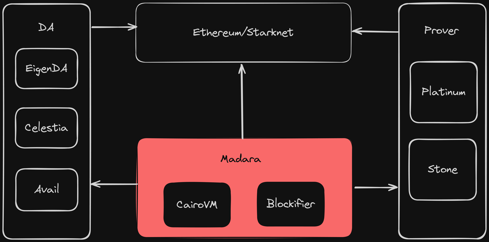

# Madara 技术栈

**Madara 是开源框架，允许任何人使用 Cairo 构建自己的应用链。**

Madara 基于经过多年实战测试并在生产环境中使用的 [Substrate 框架](https://substrate.io/)的分支构建。它为像 Polkadot、Moonbeam 和 Astar 这样的链保障了数十亿美元的资产。为了执行 Cairo 智能合约，Madara 利用 [Cairo VM](https://github.com/lambdaclass/cairo-rs) 和 [blockifier](https://github.com/starkware-libs/blockifier)，这两者都在 Starknet 生产环境中得到应用。借助 Cairo 强大功能，使任何程序执行都可以被证明。Madara 是通用型应用链构建框架，可用于构建 L2/L3 以及主权 Rollup、有效性 Rollup、Validium Rollup。

 

 

## 为何要构建应用链？

虽然构建应用链的原因有很多，如下所述，但大多数原因归结为主权性。这里主权并不是指[此处](https://celestia.org/learn/sovereign-rollups/an-introduction/)定义的主权 Rollup（本身就是一个新颖的概念！）。而是指您技术栈的主权性。

运行自己的链，选择技术架构得特别谨慎 —— 账户抽象、替代的数据可用性(Data Availability, DA)层、新操作码等。在 web2 世界中，这一切都由你掌控。无人强制你使用特定版本的 Rust，也不会限制你只能使用 SQL 数据库。你可以根据应用需求自由挑选合适的技术，并按此构建。

以太坊众多的 [EIP](https://eips.ethereum.org/all)（以太坊改进提案）清单明确反映了应用链的需求。有些 EIP 明显有利于协议改进，但部署到主网可能需要数年。这种设计是以太坊的特性，而非缺陷。然而，这并不意味着你必须等待数年才能推出你的应用。利用像 Madara 这样的框架，可以迅速启动一条应用链，利用零知识证明（ZK）技术实现以太坊级别的安全性，同时还能在技术层面上提供完整的创新灵活性。

应用链的可能性无限，没有界限。一些常见的想法和优势包括：

1. 在 VM 中新增操作码或使用完全不同的 VM
2. 原生帐户抽象
3. 自定义费用代币或完全免费
4. 使用替代的 DA 层来节省费用
5. 更快的吞吐量，无需竞争区块空间
6. 协议层的自定义逻辑
7. 还有更多！

## 应用链技术的先驱

StarkWare 早在 [2021 年](https://medium.com/starkware/fractal-scaling-from-l2-to-l3-7fe238ecfb4f)就孕育了应用链扩容的愿景。事实上，Cairo 是最早的几种 ZK 技术之一，已经被用来扩展以太坊。dYdX、Immutable、Sorare、StarkNet 以及许多其他链已经使用 Cairo 技术多年，这使得它成为最实战考验的 ZK 扩容技术。如今，Cairo 保护着超过七亿美元的资产，并且已经用于交易超过一万亿美元。

之前，部署 Cairo 链的唯一方式是通过 StarkEx，这是 StarkWare 提供的一个闭源解决方案。然而，现在我们正在用 Madara 改变这一局面。正如所提到的，Madara 是一个开源框架，允许任何人利用 Cairo 和 StarkNet 技术的威力实现应用链。

## 构建完整性网络

[Eli Ben-Sasson](https://twitter.com/EliBenSasson)（zkSTARK 技术的共同发明者兼 Starkware 的联合创始人）在[他的博客中](https://hackmd.io/@Elibensasson/ryMelVulp)精彩地描述了完整性网络和 Starknet 的愿景。Madara 非常认同这一愿景，并相信未来将会出现成千上万个这样的完整性网络。每一个网络都将在解决特定问题上高效运作 —— 无论是金融、供应链、社会还是其他需要诚实计算的领域。所有这些网络将会在保持完整性的同时，实现透明的互操作。Madara 作为一个开源框架，帮助这些网络实现完整性，每种应用都能构建一条应用链！
