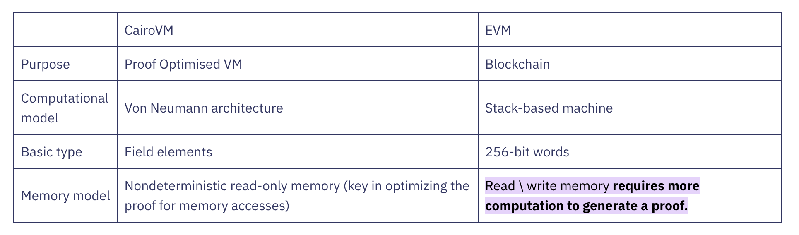

# Cairo

## Ethereum roadmap

It has been well established within the Ethereum community that rollups are the most effective way to scale Ethereum
and remain credibly neutral and decentralized at the same time. This has led to Ethereum's [rollup-centric roadmap](https://ethereum-magicians.org/t/a-rollup-centric-ethereum-roadmap/4698)
which is now being worked upon by multiple companies and developers in the Ethereum ecosystem. It's no surprise that we are going to see thousands
of rollups in the future. While each rollup is going to be different in terms of business logic and use cases, the technical fundamentals largely fall into one of the
two categories: Optimistic and ZK rollups. We won't go into the details of the two but Vitalik's [post](https://vitalik.eth.limo/general/2021/01/05/rollup.html) covers them in detail.

> In general, my own view is that in the short term, optimistic rollups are likely to win out for general-purpose EVM computation and ZK rollups are likely to win out for simple payments, exchange
> and other application-specific use cases, but in the medium to long term ZK rollups will win out in all use cases as ZK-SNARK technology improves.
>
> \- Vitalik

In short, Optimistic rollups are good solutions until we don't have efficient and cheap ZK tech to verify execution. However, once we have that - an ergonomic programming language which
can be efficiently proven and easily written - ZK rollups allow near-instant verifiability and composability for app chains, something which cannot just happen with
Optimistic rollups.

## Why Cairo?

### Faster Proving

Cairo was built to be provable since day one. While Solidity has been battle-tested over the years, it was
never made considering proving in mind. It was simply a smart contract language for Ethereum. On the contrary,
Cairo has been built by Starkware (the pioneers of ZK technology) and has been optimized for proving and
verifiability since the start.

_Image has been taken from [here](<https://www.cairo-lang.org/the-whats-what-of-the-cairo-world/#:~:text=The%20Cairo%20VM%20is%20intentionally,EVM%20(Ethereum%20virtual%20machine).&text=Read%20%5C%20write%20memory%20requires%20more%20computation%20to%20generate%20a%20proof.>)_

### A better smart contract language

While Solidity is an older and more popular language for writing smart contracts, it's also the first attempt at creating
a smart contract language. As a result, it has had a lot of shortfalls that Cairo solves keeping proving aside. This includes but is
not limited to stack management, linear type system, and function imports. You can read more about the language [here](https://book.cairo-lang.org/).

### Battle tested ZK tech

The EVM might be older in terms of a smart contract VM. However, when it comes to the zkEVM, it's relatively new and has just started
to get tested. On the other hand, Cairo based app chains go as far back as early as [2021](https://dydx.exchange/blog/public). The Cairo tech has been
used by dYdX, Sorare, Starknet, and many others over the years and today it has been used to trade more than $1 trillion in volume and currently
secure upwards of $700 million in TVL.
