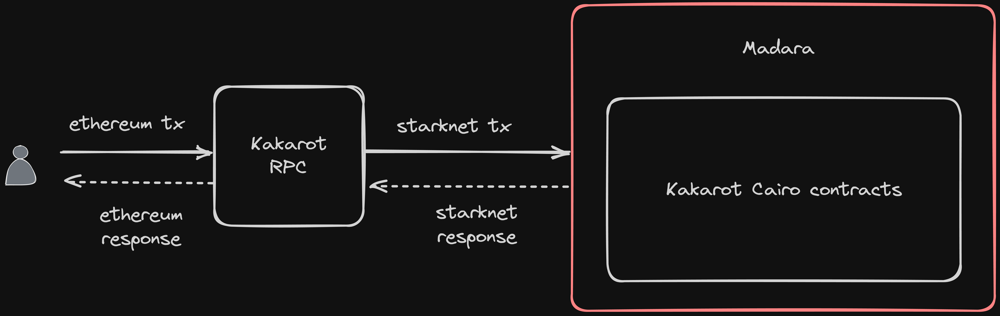

# EVM on Madara

While we strongly believe that Cairo is not only an efficient proving language but also an advanced smart contract language (more details [here](./cairo)), there can be multiple reasons why you want to
deploy on EVM

1. You already have audited smart contracts that you want to reuse
2. Your team already has Solidity experience and wants to ship something fast
3. The EVM is also improving with time and you don't want to move away just yet

Or maybe you've other perfectly valid reasons to use the EVM - and it's possible to do that with Madara! As we said, Madara is a highly customizable stack. If you want EVM compatibility, you
can leverage the [Kakarot](https://www.kakarot.org/) stack on top of Madara. Kakarot is essentially a zkEVM written in Cairo. This means your EVM code is actually still being executed in Cairo
but for end users and smart contract developers, it feels like Ethereum!

To find out more about the Kakarot architecture, you refer to the Github repos

- Kakarot - https://github.com/kkrt-labs/kakarot
- Kakarot RPC - https://github.com/kkrt-labs/kakarot-rpc
