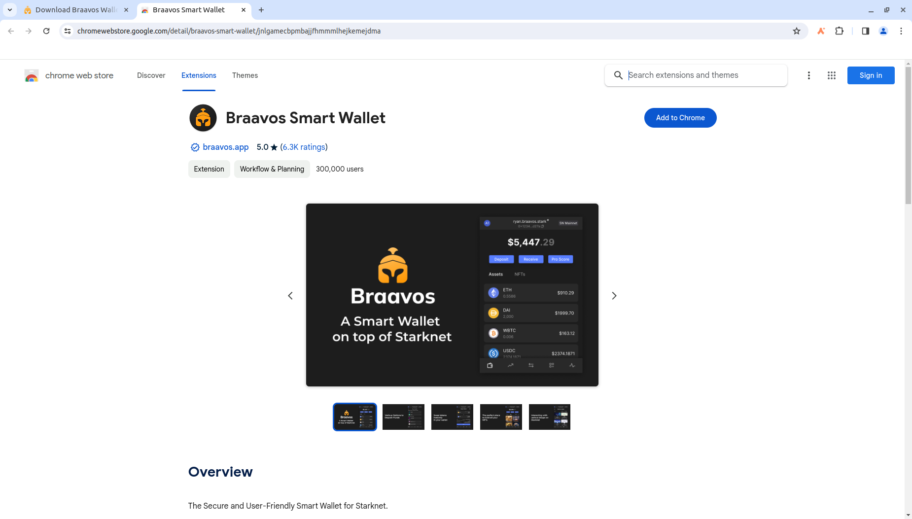
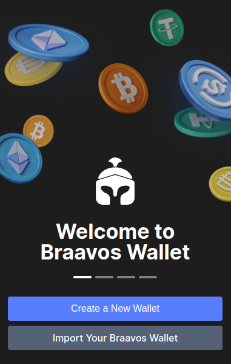
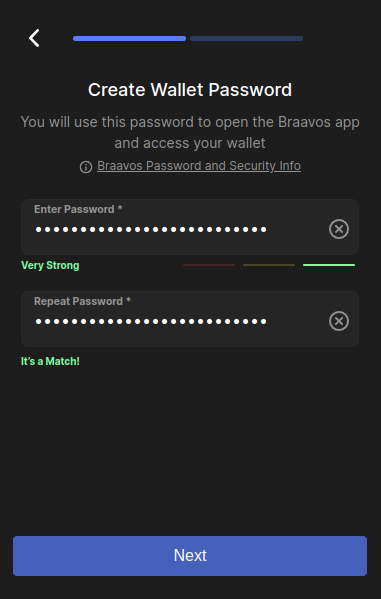
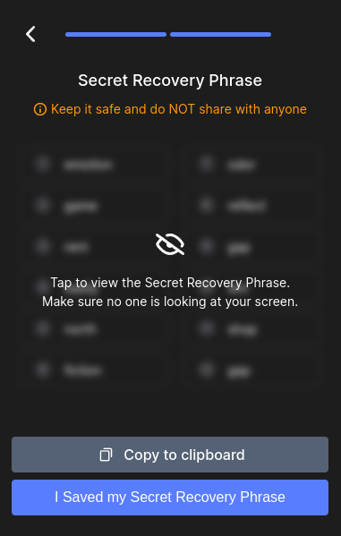

import { Steps } from "nextra-theme-docs";

# Braavos Overview

[Braavos](https://www.braavos.app) is a Starknet wallet.

## Installing Braavos

Follow the official Braavos installation [instructions](https://braavos.app/faq/setting-up-your-braavos-wallet-easy-starknet-guide/`).

## Use Braavos with Madara

Braavos includes the Mainnet, Sepolia, and Goerli networks by default, but connecting with your local Madara chain requires manual configuration. This involves adding a custom network within Braavos's settings.

### Configuring Braavos for Madara

<Steps>

### Access Network Tab

Open the Braavos wallet and navigate to the "Network" tab.

### Enable Developer Mode

Locate the "Developer" option and select it. If prompted, choose "Add Account" to proceed.

### Access General Configuration:

Click on the account icon on the top left side  

Navigate to the "General" tab

### Switch to the Developer Tab

Within the "General" section, switch to the "Developer" tab.

### Configure RPC Connection

1. Enable the "Use RPC provider" checkbox.

2. Set the "Node host" field to localhost.

3. Set the "Node port" field to 9944, assuming you're using the default Madara port.

</Steps>

Once you have added Madara as a network, you can now connect to it.

### Deploying your Starknet wallet

Upon creation, a Braavos wallet generates a Starknet address. However, this address exists in an "undeployed" state until you initiate your first transaction.

Braavos manages the activation process under the hood; your first outgoing transaction acts as the trigger.

This transaction initiates the creation and deployment of your personal smart contract on the Madara chain. This deployment incurs a one-time fee.

## Resources

- [Website](https://braavos.app/)

- [FAQ](https://braavos.app/faq/)

- [Twitter](https://twitter.com/Braavos)
